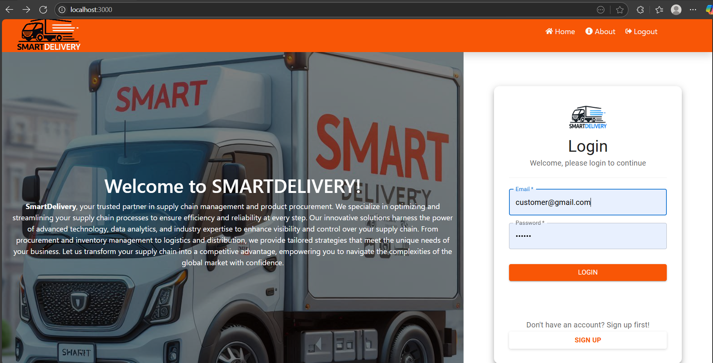
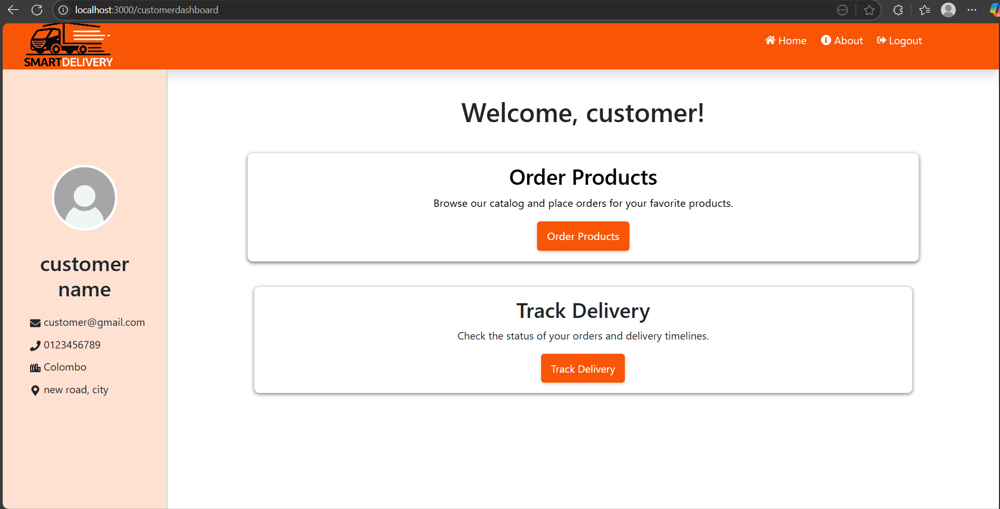
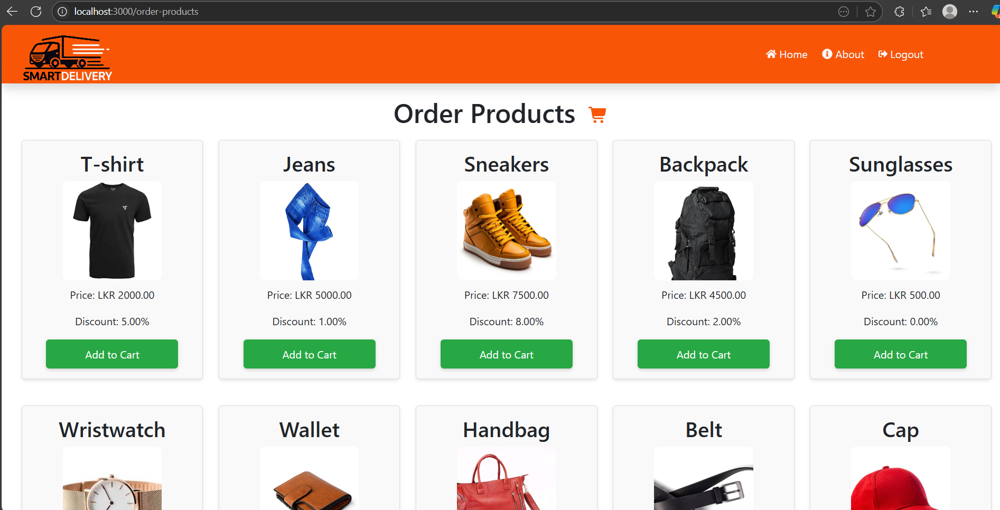
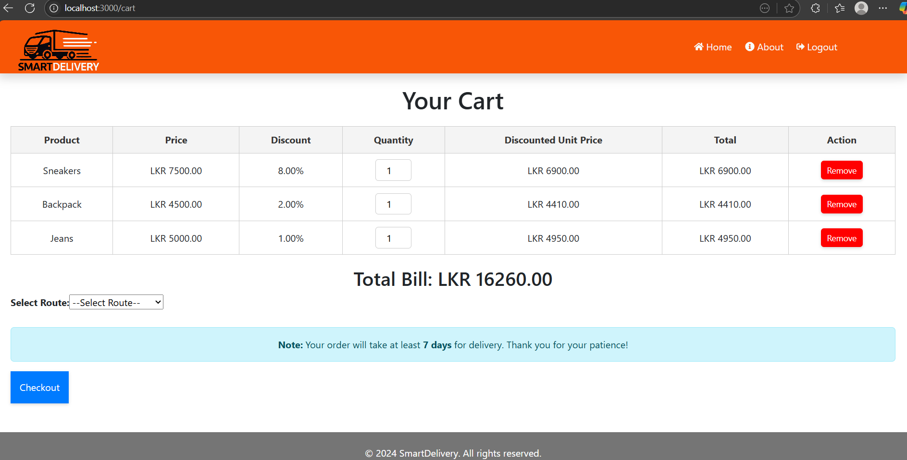
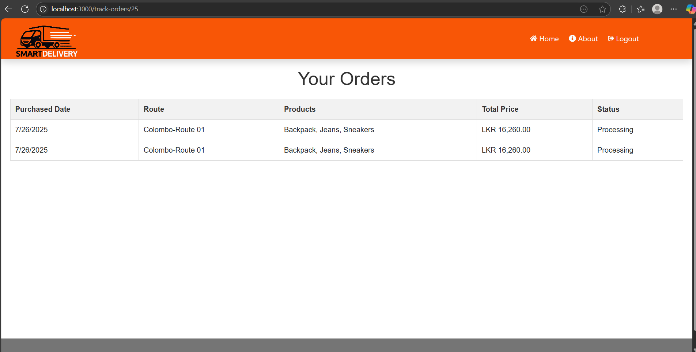

## CS3043 Database Systems Semester Project

# Supply Chain Management System

A modern web application for managing and optimizing supply chain logistics, product distribution, and reporting. The system supports multiple user roles **Customers**, **Drivers**, **Assistants**, and **Managers** each with tailored interfaces and functionalities. It streamlines order placement, scheduling, delivery, staff assignments, and analytics for efficient and reliable operations.

---

## Table of Contents

- [Features](#features)
- [Tech Stack](#tech-stack)
- [Project Structure](#project-structure)
- [Role-Based Pages](#role-based-pages)
  - [Customer](#customer)
  - [Driver](#driver)
  - [Assistant](#assistant)
  - [Manager](#manager)
- [Getting Started](#getting-started)

---

## Features

- **Order Management:** Customers can place orders, select delivery routes, and track shipments.
- **Product Distribution:** Manages distribution using trains and trucks with scheduling and capacity constraints.
- **Staff Rostering:** Assigns drivers and assistants to deliveries, enforcing work-hour and shift rules.
- **Route Planning:** Supports predefined delivery routes for major cities and stores.
- **Reporting:** Managers can generate sales (quarterly / by route), most orders, working hours(driver, assistant or truck) and customer-order reports.
- **Role-Based Dashboards:** Dedicated dashboards for Customers, Drivers, Assistants, and Managers.

---

## Tech Stack

- **Frontend:** JavaScript (React.js), HTML, CSS, Bootstrap
- **Backend:** MySQL
- **Routing:** React Router
- **Other Libraries:** Chart.js for analytics, Axios for API calls

---

## Project Structure

```
Supply-Chain-Management-System
├── database
|   └── mysql files/
├── docs                              # UI pages shown in readme
├── server                            # backend
|   ├── routes/
│   ├── utils/
│   ├── index.js
|   ├── package.json
|   └──.gitignore
└── supply-chain-management-system/   # frontend
    ├── public/
    │   └── index.html
    ├── src/
    │   ├── components/
    │   │   ├── customer/
    │   │   ├── driver/
    │   │   ├── manager/
    │   │   ├── pages/                # Home,Signup, etc.
    │   │   └── inc/                  # Navbar, Footer, etc.
    │   ├── images
    │   ├── App.js
    │   └── index.js
    ├── README.md
    ├── package.json
    └──.gitignore
```

---

## Role-Based Pages

### Customer

- Place orders, choose delivery routes, track orders, view order history.
- Dashboard: Product catalog, cart, order tracker.

**_Screenshot Placeholder:_**
<p float="left">
  
  
  
  
  
</p>

---

### Driver

- View assigned and completed truck schedules.
- Dashboard: Delivery schedule.

**_Screenshot Placeholder:_**


---

### Assistant

- View assigned and completed truck schedules.

**_Screenshot Placeholder:_**


---

### Manager

- Register staff(Drivers and assistants), schedule trucks/trains, assign orders, generate and view reports.
- Dashboard: Driver and assistant registration, create truck schedule,assign orders to trains and reporting.

**_Screenshot Placeholder:_**


---

## Getting Started

### 1. Set Up the Local MySQL Database

Since the database is not hosted, you must first create a local MySQL database using the provided SQL files.

- Ensure you have MySQL installed and running on your machine.
- Use the SQL files in the `database` folder to create and populate the database:

- The default database configuration (can be customized in `server/utils/db.js`):

  ```javascript
  import mysql from "mysql2";

  const con = mysql.createConnection({
    host: "localhost",
    user: "root",
    password: "password",
    database: "database_name",
    multipleStatements: true, // Enables multiple result sets
  });

  con.connect(function (err) {
    if (err) {
      console.log("connection error");
    } else {
      console.log("connected");
    }
  });

  export default con;
  ```

- **Edit** the `password` and `database_name` fields in `server/utils/db.js` according to your local MySQL setup.

---

### 2. Clone the repository

```bash
git clone https://github.com/Yash200237/Supply-Chain-Management-System.git
cd Supply-Chain-Management-System
```

### 3. Install and Run the Frontend

- Navigate to the frontend directory:

  ```bash
  cd supply-chain-management-system
  ```

- Install dependencies:

  ```bash
  npm install
  ```

- Start the frontend development server:
  ```bash
  npm start
  ```
- The app will run at [http://localhost:3000](http://localhost:3000).

---

### 4. Install and Run the Backend

- Open a new terminal and navigate to the backend directory:

  ```bash
  cd server
  ```

- Install dependencies:

  ```bash
  npm install
  ```

- Start the backend server:
  ```bash
  npm start
  ```
- By default, the backend will connect to your local MySQL database as configured above.

---

> **Note:** Connect to MySQL and configure backend endpoints as needed for full functionality.
